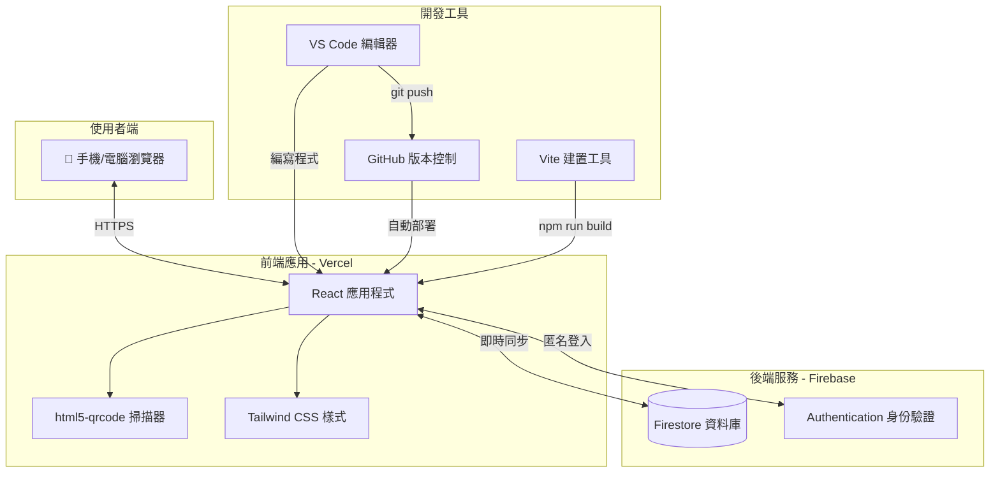
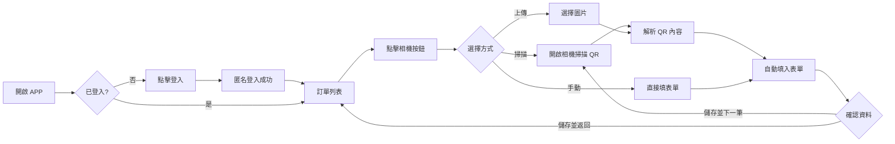
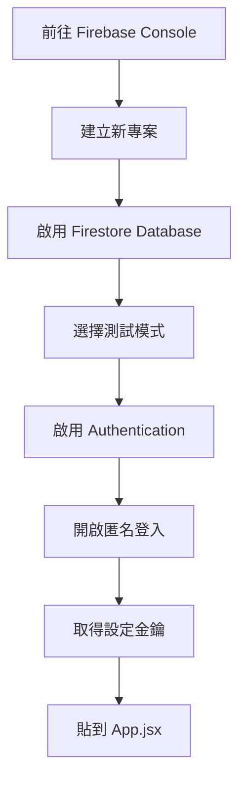
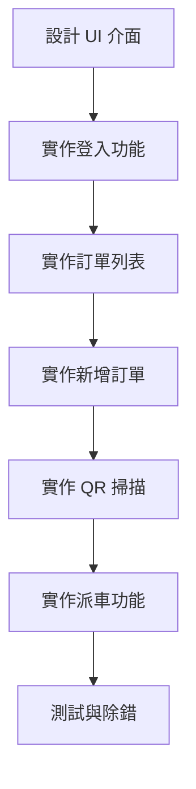
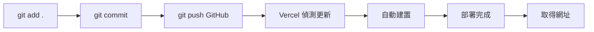
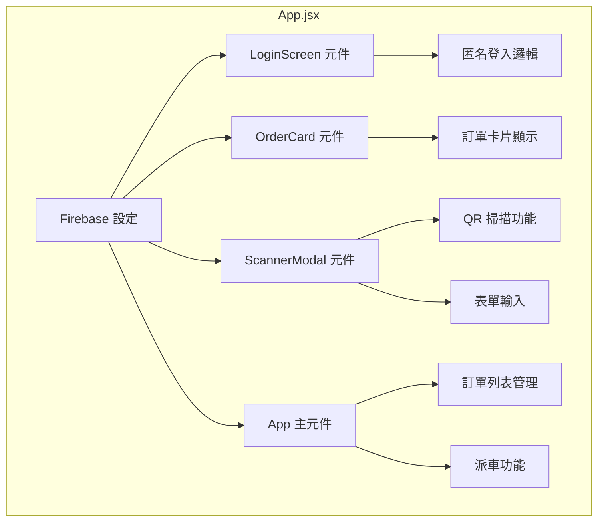
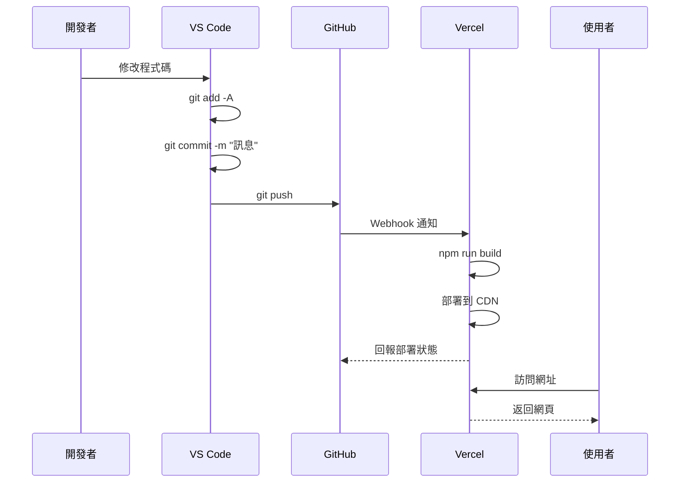
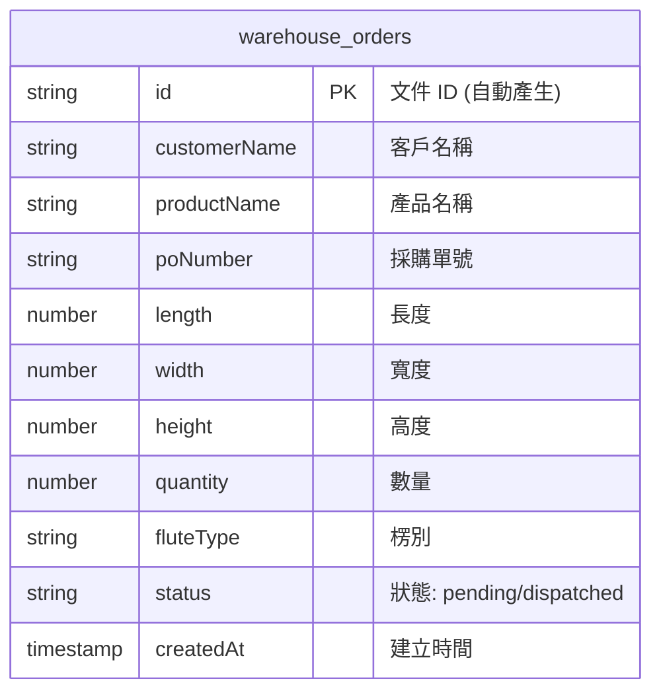
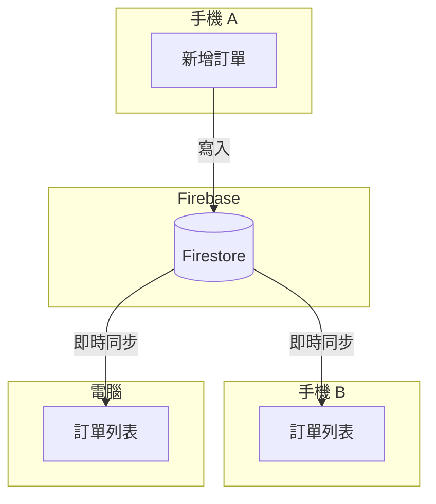

# 📦 WH-QR-Code 倉儲掃描通 - 開發設計文件

> 本文件記錄專案從零到部署的完整過程，適合程式初學者理解現代 Web 應用開發流程。

---

## 📋 目錄

1. [專案概述](#專案概述)
2. [系統架構圖](#系統架構圖)
3. [技術棧說明](#技術棧說明)
4. [開發流程](#開發流程)
5. [檔案結構](#檔案結構)
6. [部署流程](#部署流程)
7. [資料流程](#資料流程)

---

## 專案概述

### 🎯 目標
建立一個倉儲管理 PWA 應用，支援：
- QR Code 掃描入庫
- 訂單管理（新增、刪除、派車）
- 即時資料同步
- 手機安裝使用

### 👥 使用情境
```
倉庫人員 → 手機掃描 QR Code → 資料自動填入 → 儲存到雲端 → 主管即時查看
```

---

## 系統架構圖

### 整體架構


### 使用者操作流程


---

## 技術棧說明

| 類別 | 技術 | 用途 |
|------|------|------|
| **前端框架** | React 18 | 建立使用者介面元件 |
| **建置工具** | Vite | 快速開發與打包 |
| **樣式框架** | Tailwind CSS | 快速設計 UI 樣式 |
| **圖示庫** | Lucide React | 提供各種 icon |
| **掃描功能** | html5-qrcode | QR Code 掃描與解析 |
| **資料庫** | Firebase Firestore | 雲端 NoSQL 資料庫 |
| **身份驗證** | Firebase Auth | 匿名登入功能 |
| **版本控制** | Git + GitHub | 程式碼管理與協作 |
| **部署平台** | Vercel | 自動化部署與託管 |

---

## 開發流程

### 第一階段：環境建置


**執行的指令：**
```bash
# 1. 建立專案
npm create vite@latest warehouse-scanner -- --template react

# 2. 進入專案
cd warehouse-scanner

# 3. 安裝基本相依
npm install

# 4. 安裝額外套件
npm install firebase html5-qrcode lucide-react
npm install -D tailwindcss postcss autoprefixer
npx tailwindcss init -p

# 5. 啟動開發伺服器
npm run dev
```

### 第二階段：Firebase 設定


### 第三階段：程式開發


### 第四階段：部署上線


---

## 檔案結構

```
WH-QR-Code/
├── 📁 src/                    # 原始碼目錄
│   ├── 📄 App.jsx             # 主要應用程式 (所有功能都在這)
│   ├── 📄 main.jsx            # 程式進入點
│   └── 📄 index.css           # Tailwind CSS 引入
├── 📁 public/                 # 靜態資源
├── 📄 index.html              # HTML 模板
├── 📄 package.json            # 專案設定與相依套件
├── 📄 vite.config.js          # Vite 建置設定
├── 📄 tailwind.config.js      # Tailwind 設定
├── 📄 postcss.config.js       # PostCSS 設定
└── 📄 WH-QR-CODE開發設計.md   # 本文件
```

### App.jsx 程式結構


---

## 部署流程

### GitHub + Vercel 自動部署


### 部署指令速查
```bash
# 查看狀態
git status

# 加入所有變更
git add -A

# 提交變更
git commit -m "說明這次改了什麼"

# 推送到 GitHub (觸發 Vercel 自動部署)
git push
```

---

## 資料流程

### Firestore 資料結構


### 資料同步流程


---

## 常見問題排解

### ❓ 樣式沒有載入 (只有文字)
**原因：** Tailwind CSS 沒有正確編譯
**解決：**
1. 確認 `tailwind.config.js` 的 `content` 設定正確
2. 確認 `src/index.css` 有引入 Tailwind 指令
3. 重新執行 `npm run build`

### ❓ 資料沒有儲存到 Firebase
**原因：** Firestore 安全規則阻擋
**解決：**
1. 前往 Firebase Console → Firestore → 規則
2. 改成測試模式規則 (allow read, write: if true)
3. 點擊發布

### ❓ QR Code 掃描沒反應
**原因：** 需要 HTTPS 和相機權限
**解決：**
1. 確認網址是 `https://` 開頭
2. 允許瀏覽器使用相機權限
3. 可改用「上傳圖片」功能

---

## 未來擴充方向

- [ ] 使用者帳號系統 (Email 登入)
- [ ] 訂單搜尋與篩選
- [ ] 匯出 Excel 報表
- [ ] 多倉庫支援
- [ ] 庫存統計圖表
- [ ] 推播通知

---

## 參考資源

| 資源 | 連結 |
|------|------|
| React 官方文件 | https://react.dev |
| Vite 官方文件 | https://vitejs.dev |
| Tailwind CSS | https://tailwindcss.com |
| Firebase 文件 | https://firebase.google.com/docs |
| Vercel 文件 | https://vercel.com/docs |
| html5-qrcode | https://github.com/mebjas/html5-qrcode |

---

*最後更新：2025-11-28*

